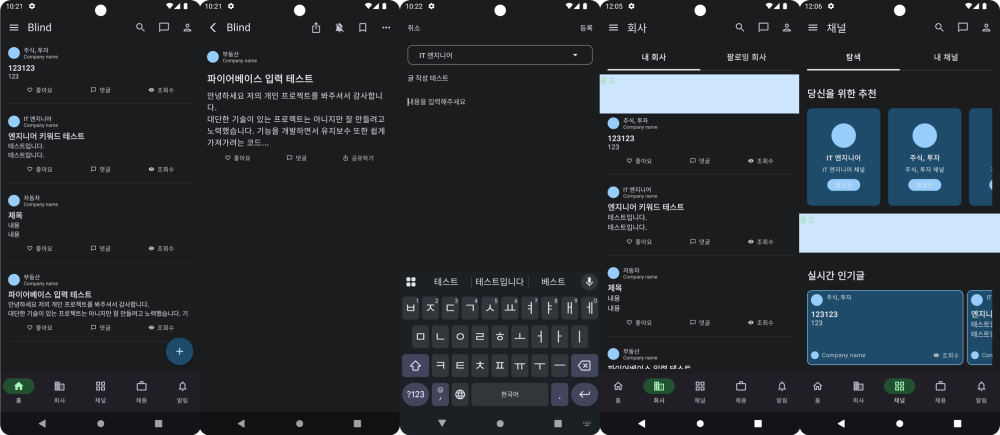

# Blind-clone
커뮤니티 기능을 중점적으로 공부하기 위해 제작한 프로젝트 입니다. Android-Kotlin으로 개발하였습니다.

## 📖 프로젝트 소개
블라인드 클론 프로젝트 입니다. Firebase Realtime Database에 게시글을 저장하고 불러 올 수 있습니다. 
게시판을 Compose - Flow로 구현하였고 안드로이드 추가 라이브러리를 사용하여 Flow를 앱 라이프 사이클에 맞게 구현하여 리소스 낭비를 하지 않도록 구현하였습니다.

## 🛠 기술 스택
Language : Kotlin  
View : Compose  
AndroidX : Room, ViewModel, Hilt, AndroidX-Flow-Lifecycle  
Kotlin : Coroutine, StateFlow  
etc : Firebase Realtime Database, Retrofit, OkHttp  

## ✨ 주요 기능
- 실시간 데이터베이스 데이터 동기화 (Firebase Realtime Database)
- 내부 데이터베이스 저장 (Room Database)
- Compose + StateFlow를 사용한 MVI 패턴 사용

## 🏞️ 화면

## 👀 개발 과정에서 발생한 이슈

### 1. 실시간성 데이터 표현 방식
기존 Refresh 방식으로 구현되어 있는 Blind와 다르게 실시간으로 파이어베이스 데이터베이스를 구독하고 변경이 발생하면
리스트가 업데이트 되도록 구현 해봤습니다. 서비스 고도화를 진행하여 게시글은 Refresh 방식으로 구현할 것 같습니다.

### 2. 프로젝트 아키텍처 및 패턴
클론을 시작한 시점에 서비스 규모가 작기 때문에 간단한 패턴을 사용해서 구현할까 생각했지만,
전반적으로 안드로이드 개발할때 많이 사용하고 큰 프로젝트를 개발하는 경우와 구조를 연습하기 위해서 규모에 비해 복잡한 아키텍처로 구현하였습니다.  
최근 가장 많이 사용하는 MVI 패턴을 사용하였고, Compose + StateFlow로 구현하였습니다.
Hilt를 사용해서 DI를 구현하였고 Repository Interface와 구현체로 구현하였습니다.

## 🎯 개발 계획 
 - 모든 화면 구현
 - 각 화면별로 Post List 필터링 및 Refresh 변경
 - 내부 데이터베이스 연동
