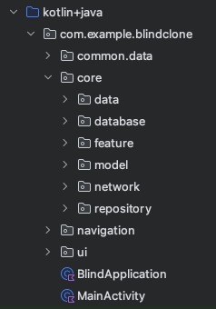

# Blind-clone

## 설명
블라인드 클론 프로젝트

## 화면
| Home                                    | Write                                    |
|-----------------------------------------|------------------------------------------|
|  |  |

## 프로젝트 구조

## 구현 기능
- 실시간 데이터베이스 동기화 (Firebase Realtime Database)

## 기술 스택
Language : Kotlin  
View : Compose  
AndroidX : Room, ViewModel, Hilt, AndroidX-Flow-Lifecycle  
Kotlin : Coroutine, StateFlow  
etc : Firebase Realtime Database, Retrofit, OkHttp  
